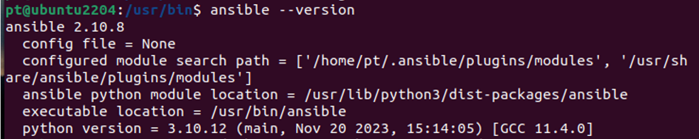
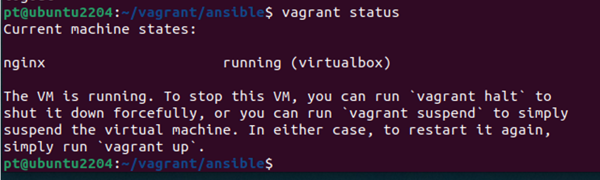
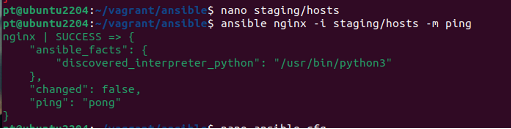
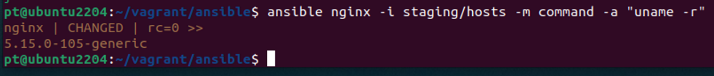
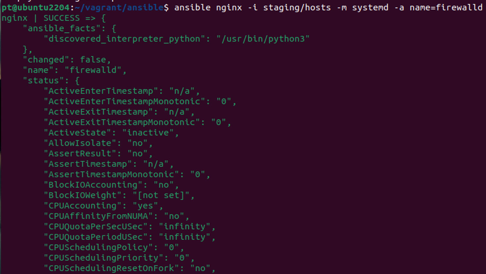
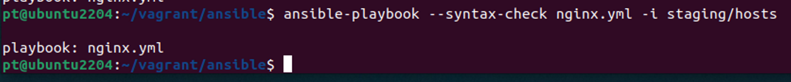
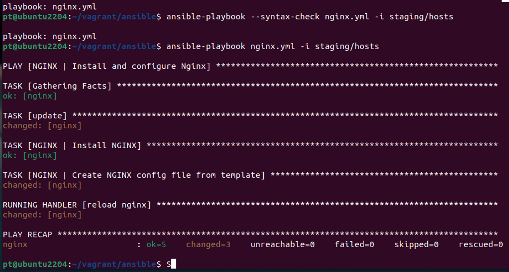
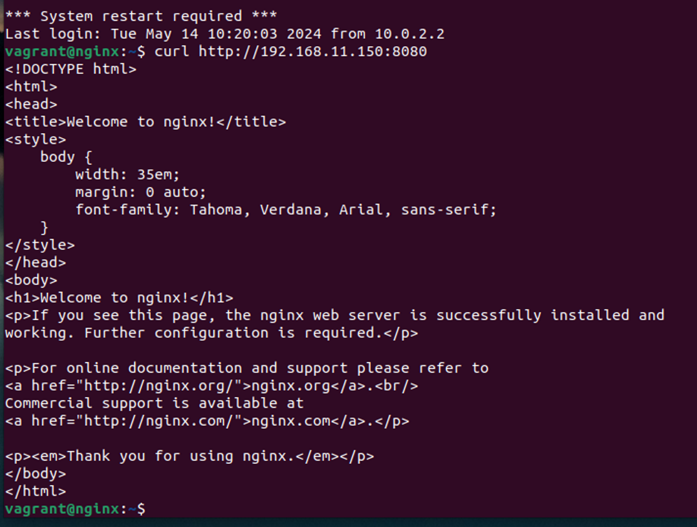

# homework-ansible
Описание домашнего задания
Подготовить стенд на Vagrant как минимум с одним сервером. На этом сервере используя Ansible необходимо развернуть nginx со следующими условиями:

-необходимо использовать модуль yum/apt;
-конфигурационные файлы должны быть взяты из шаблона jinja2 с перемененными;
-после установки nginx должен быть в режиме enabled в systemd;
-должен быть использован notify для старта nginx после установки;
-сайт должен слушать на нестандартном порту - 8080, для этого использовать переменные в Ansible.

---
- Этап 1: Установлен ansible версии 2.10.8


- Этап 2: Загружена виртуальная машина из Vagrantfile (с использованием ранее скаченного и добавленного box)


- Этап 3: Подготовлен и протестирован inventory файл (подключение к запущенной ВМ)
```bash
ansible nginx -i staging/hosts -m ping
# флаг -i указывает на явное использование конкретного inventory 
```


- Этап 4: Проверены версия ядра и статус сервиса firewalld на сервере nginx
```bash
ansible nginx -i staging/hosts -m command -a "uname -r"
ansible nginx -i staging/hosts -m systemd -a name=firewalld
```



- Этап 5: Написан playbook и template, + проверен playbook
```bash
ansible-playbook --syntax-check nginx.yml -i staging/hosts
```



- Этап 5: Проверено, что на nginx доступен сайт по адресу http://192.168.11.150:8080 (на нужном порту)

